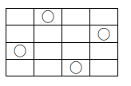

# Laboratoria:
### [Lab 1](https://github.com/dawidolko/Algorithms-Data-Structures/tree/main/Laboratoria/Lab1) - Laboratoria 1
### [Lab 2](https://github.com/dawidolko/Algorithms-Data-Structures/tree/main/Laboratoria/Lab2) - Laboratoria 2
### [Lab 3](https://github.com/dawidolko/Algorithms-Data-Structures/tree/main/Laboratoria/Lab3) - Laboratoria 3
### [Lab 4](https://github.com/dawidolko/Algorithms-Data-Structures/tree/main/Laboratoria/Lab4) - Laboratoria 4
### [Lab 5](https://github.com/dawidolko/Algorithms-Data-Structures/tree/main/Laboratoria/Lab5) - Laboratoria 5
### [Lab 6](https://github.com/dawidolko/Algorithms-Data-Structures/tree/main/Laboratoria/Lab6) - Laboratoria 6
### [Lab 7](https://github.com/dawidolko/Algorithms-Data-Structures/tree/main/Laboratoria/Lab7/LinkedList) - Laboratoria 7
### [Lab 8](https://github.com/dawidolko/Algorithms-Data-Structures/tree/main/Laboratoria/Lab8) - Laboratoria 8
### [Lab 9](https://github.com/dawidolko/Algorithms-Data-Structures/tree/main/Laboratoria/Lab9) - Laboratoria 9

### [A.1](https://github.com/dawidolko/Algorithms-Data-Structures/blob/main/Laboratoria/A1.java) Decyzyjny problem plecakowy

Dany jest plecak o pojemności \( W = 10 \) oraz \( 6 \) przedmiotów ponumerowanych od \( 0 \) do \( 5 \). Każdy przedmiot ma określoną wartość i objętość. Należy zapakować plecak spośród przedmiotów ponumerowanych od \( 0 \) do \( 5 \) w taki sposób, aby wartość przedmiotów w nim zgromadzonych była największa. Wartości i objętości przedmiotów określone są w poniższej tabeli:

|   | 0 | 1 | 2 | 3 | 4 | 5 |
|---|---|---|---|---|---|---|
| v | 6 | 2 | 3 | 2 | 3 | 1 |
| w | 6 | 4 | 5 | 7 | 10 | 2 |

Odp: W plecaku o maksymalnej wartości znajdują się przedmioty 1,2,3,4 o wartości 26.

### [A.2](https://github.com/dawidolko/Algorithms-Data-Structures/blob/main/Laboratoria/A2.java) Ogólny problem plecakowy

Dany jest plecak o objętości v = 23 oraz nieograniczona liczba egzemplarzy 6 różnych przed- miotów ponumerowanych od 0 do 5. Każdy przedmiot ma określoną wartość Wi i objętość Vi. Należy zapakować plecak spośród przedmiotów ponumerowanych od 0 do 5 w taki sposób, aby wartość przedmiotów w nim zgromadzonych była największa. Wartości i objętości przedmiotów określone są w poniższej tabeli:

|   | 0 | 1 | 2 | 3 | 4 | 5 |
|---|---|---|---|---|---|---|
| v | 6 | 2 | 3 | 2 | 3 | 1 |
| w | 6 | 4 | 5 | 7 | 10 | 2 |

Odp: W plecaku o maksymalnej wartości znajdzie się dziesięć przedmiotów z numerem 3 i jeden
przedmiot z numerem 4. Łączna wartość przedmiotów w plecaku wyniesie 80.

### [A.3](https://github.com/dawidolko/Algorithms-Data-Structures/blob/main/Laboratoria/A3.java) Problem liczby pitagorejskich

Liczby pitagorejskie - to trzy liczby naturalne x, y, z, które spełniają warunek x2 + y2 = z2. Znaleźć wszystkie takie trójki liczb, przy założeniu, że każda z tych liczb ma należy do zbioru {1, ..., 30}.

### [A.4](https://github.com/dawidolko/Algorithms-Data-Structures/blob/main/Laboratoria/A4.java) Problem doboru załogi statku kosmicznego / Podzbiory2Kosmos

Organizowana jest załogowa ekspedycja kosmiczna na Marsa. W ramach kompletowania załogi statku kosmicznego główny organizator ekspedycji ma rozwiązać następujący problem. Do jego dyspozycji jest pięciu kosmonautów (k1, k2, k3, k4, k5), którzy przeszli pozytywnie kwalifikację wstępną do udziału w ekspedycji. Na pokładzie specjalnego statku kosmicznego spośród nich będzie potrzebny przynajmniej jeden specjalista w każdej z dziedzin: A, B, C i D. Wiadomym jest, że w dziedzinie A specjalizują się kosmonauci k1 i k4, w dziedzinie B specjalizują się kosmonauci k2, k3 i k4, w dziedzinie C specjalizują się kosmonauci k3 i k5 oraz w dziedzinie D specjalizują się kosmonauci k1, k2 i k5. Ze względu na szczupłość miejsca na pokładzie statku kosmicznego, z powyższej piątki trzeba wybrać jak najmniejszą grupkę kosmonautów, tak aby znajdował się w niej przynajmniej jeden specjalista w każdej z dziedzin A, B, C, D.

Odp: Na Marsa mogą polecieć np. kosmonauci k4 i k5.

### [A.5](https://github.com/dawidolko/Algorithms-Data-Structures/blob/main/Laboratoria/A5.java) Problem wyprodukowania lodów wszystkich smaków

Fabryka lodów każdego dnia produkuje na tej samej maszynie lody o sześciu różnych smakach. Zmiana produkcji ze smaku \( i \) na smak \( j \) wymaga przestojenia maszyny, czyli przygotowania (w tym umycia) do nowej produkcji, które trwa określony czas. Podana niżej tablica zawiera informacje o czasach przestojenia maszyny.

| \( \ \)  | 1 | 2 | 3 | 4 | 5 | 6 |
|---------|---|---|---|---|---|---|
| **1**   | 0 | 7 | 20 | 21 | 12 | 23 |
| **2**   | 27 | 0 | 13 | 16 | 46 | 5 |
| **3**   | 53 | 15 | 0 | 25 | 27 | 6 |
| **4**   | 16 | 2 | 5 | 0 | 47 | 10 |
| **5**   | 31 | 29 | 5 | 18 | 0 | 4 |
| **6**   | 28 | 24 | 1 | 17 | 5 | 0 |

Znaleźć kolejność produkcji, przy której całkowity czas przestrojenia maszyny jest mini- malny. Przyjąć, że na koniec dnia maszyna ma być przygotowana do produkcji w następnym dniu.

Odp: Minimalny całkowity czas przestrojenia maszyny wynosi 63. Oto przykładowa kolejność produkcji lodów, dla której całkowity czas przestrojenia maszyny jest minimalny: 1,2,6,5,3,4,1.

### [A.6](https://github.com/dawidolko/Algorithms-Data-Structures/blob/main/Laboratoria/A6.java) Problem odgadywania liczby
Jak odgadnac liczbe pomyslana przez rozmówce z zakresu od 0 do 1000, zadajac jak najmniejsza
liczbe pytan rozmówcy? Przy czym, pytania zadawane rozmówcy musza byc jedynie
typu: „Czy to jest liczba 546?”, na które rozmówca moze odpowiadac na jeden z nastepujacych
sposobów: „TAK”, „ZA MAŁA” lub „ZA DUZA”.

### [A.7](https://github.com/dawidolko/Algorithms-Data-Structures/blob/main/Laboratoria/A7.java) Problem planowania produkcji mebli
Wytwórca mebli produkuje stoły, krzesła, biurka i szafy biblioteczne. Do produkcji wykorzystuje
dwa typy desek. W magazynie wytwórca posiada 1500 m pierwszego typu desek i 1000 m
drugiego. Dysponuje kapitałem 860 godzin roboczych na wykonanie całej pracy. Przewidywane
zapotrzebowanie plus potwierdzone zamówienia wymagaja wykonania co najmniej 40 stołów,
130 krzeseł, 30 biurek i nie wiecej niz 10 szaf bibliotecznych. Kazdy stół, krzesło, biurko i szafa
biblioteczna wymaga odpowiednio 5, 1, 9 i 12 m desek pierwszego typu i 2, 3, 4 i 1 m desek
drugiego typu. Na wykonanie stołu potrzebne sa 3 godziny pracy, krzesła 2 godziny, biurka 5
godzin i szafy bibliotecznej 10 godzin. Przy sprzedazy jednego stołu, krzesła, biurka i szafy
bibliotecznej wytwórca osiaga zysk odpowiednio 48 złotych, 20 złotych, 60 złotych i 40 złotych.
Zaplanowac produkcje mebli w ten sposób, aby wytwórca wywiazał sie z przyjetych zamówien
i osiagnał maksymalny zysk.

Odp: Wytwórca otrzyma maksymalny zysk 11600 złotych, jezeli wyprodukuje 150 stołów, 130
krzeseł i 30 biurek.

### [A.8](https://github.com/dawidolko/Algorithms-Data-Structures/blob/main/Laboratoria/A8.java) Problem planowania diety dziecka
Matka chce, aby jej dzieci otrzymały pewne ilosci czynników odzywczych w porannej
owsiance. Dzieci moga wybrac płatki owsiane firmy A lub firmy B albo mieszanine tych dwóch.
Ich sniadanie powinno zawierac co najmniej 1 mg witaminy B1, 5 mg witaminy PP i 400 kalorii.
Wiadomo, ze 30 g płatków firmy A zawiera 0.1 mg witaminy B1, 1 mg witaminy PP i 110
kalorii. Natomiast 30 g płatków firmy B zawiera 0.25 mg witaminy B1, 0.25 mg witaminy PP
i 120 kalorii. Cena 30 g płatków firmy A i płatków firmy B wynosi odpowiednio 16 i 18 groszy.
W jaki sposób nalezy przyrzadzic poranna owsianke, aby spełnione były warunki zdrowotne,
a cena produktów była mozliwie najnizsza.

Odp: Minimalny koszt 116 groszy uzyskamy, jesli przyrzadzimy sniadanie z 5 porcji płatków
firmy A i 2 porcji płatków firmy B.

### [A.9](https://github.com/dawidolko/Algorithms-Data-Structures/blob/main/Laboratoria/A9.java) Problem planowania zawartosci zestawu paszowego
W zestaw paszowy bydła w okresie zimowym wchodza trzy składniki: siano, kiszonka i pasza
tresciwa, które zawieraja trzy rodzaje podstawowych składników odzywczych, takich jak: białko,
wapno i witaminy. Ich zawartosc w kilogramie paszy, ceny (w złotówkach za kilogram) oraz
minimalne normy dzienne (w kilogramach) niezbedne do prawidłowego odzywiania bydła podaje
ponizsza tabelka.

| Rodzaje paszy        | Składniki odżywcze |      |      | Ceny |
|----------------------|--------------------|------|------|------|
|                      | białko             | wapno| witaminy|      |
| Siano               | 50                | 6   | 2    | 3    |
| Kiszonka            | 20                | 4   | 1    | 2    |
| Pasza treściwa      | 180               | 3   | 1    | 5    |
| Mineralne normy dzienne | 2 000          | 120 | 40   | -    |

Ustalic dzienny zestaw paszowy o minimalnych kosztach przy dodatkowym załozeniu, ze w
normie dziennej ilosc siana nie przekroczy 10 kilogramów.

Odp: Minimalny koszt 91 złotych uzyskamy dla zestawu paszowego: 10 kg siana, 13 kg kiszonki,
7 kg paszy tresciwej.

### [A.10](https://github.com/dawidolko/Algorithms-Data-Structures/blob/main/Laboratoria/A10.java) Problem czterech hetmanów
Jak umiescic 4 hetmanów na szachownicy 4x4 tak, aby nie biły sie wzajemnie, tzn. zadnych
dwóch hetmanów nie było umieszczonych w tym samym wierszu, kolumnie lub na przekatnej
szachownicy.

Odp: Oto przykładowy rozkład hetmanów na szachownicy:

<br>

### [A.11](https://github.com/dawidolko/Algorithms-Data-Structures/blob/main/Laboratoria/A11.java) Problem planowania liczebnosci klas
Zaplanowac liczbe uczniów w klasach Ia, Ib, Ic, Id przy załozeniu, ze do szkoły przyjeto 68
dziewczat i 54 chłopców. Maksymalna liczba uczniów w poszczególnych klasach moze wynosic:

|    |    |
|----|----|
| 1a | 32 |
| 1b | 28 |
| 1c | 34 |
| 1d | 36 |

Dodatkowo wymaga sie, aby w poszczególnych klasach liczba dziewczat była wieksza lub
równa liczbie chłopców.

Odp: W ponizszej tabeli podany jest przykładowy rozkład uczniów w klasach:

|    | ch | dz |
|----|----|----|
| 1a | 5  | 19 |
| 1b | 14 | 14 |
| 1c | 17 | 17 |
| 1d | 18 | 18 |

### [A.12](https://github.com/dawidolko/Algorithms-Data-Structures/blob/main/Laboratoria/A12.java) Problem wysyłania pociagów
Z miejscowosci wypoczynkowej mozna w koncu sezonu wysłac najwyzej 12 pociagów dziennie.
Sa to pociagi spalinowe (tzn. z lokomotywami o napedzie spalinowym) albo elektryczne (tzn.
z lokomotywami o napedzie elektrycznym). Wszystkie miejsca w tych pociagach sa numerowane
(czyli sa to tzw. „miejscówki”). w skład kazdego pociagu spalinowego wchodzi 2 wagony
80-osobowe i 4 wagony 48-osobowe. Natomiast w skład kazdego pociagu elektrycznego wchodzi
5 wagonów 80-osobowych i 2 wagony 48-osobowe. Stacja moze wysłac dziennie najwyzej 42
wagony 80-osobowe i najwyzej 40 wagonów 48 osobowych. Ile i jakich pociagów nalezy wysłac
dziennie, aby liczba przewiezionych pasazerów była mozliwie najwieksza? Przyjac, ze liczba
lokomotyw kazdego rodzaju nie jest ograniczona.

Odp: Liczba przewiezionych pasazerów bedzie najwieksza i wyniesie 5088 osób, jezeli bedziemy
codziennie wysyłac 6 pociagów spalinowych i 6 pociagów elektrycznych.

### [A.13](https://github.com/dawidolko/Algorithms-Data-Structures/blob/main/Laboratoria/A13.java) Problem przydziału maszyn
Fabryka produkuje dwa modele: A i B. Kazdy model musi kolejno przejsc przez dwie
maszyny I i II. Dla wykonania kazdego egzemplarza A maszyna I musi pracowac jedna godzine, a
maszyna II - 2.5 godziny. Dla wykonania modelu B maszyny I i II musza pracowac odpowiednio
4 godziny i 2 godziny. Maszyna I moze byc w ruchu najwyzej 8 godzin dziennie, a maszyna II -
12 godzin. Kazdy model A przynosi 120 złotych zysku, natomiast kazdy model B przynosi 160
złotych zysku. Ilu sztuk kazdego modelu powinna produkowac dziennie fabryka, aby zysk ze
sprzedazy był mozliwie najwiekszy?

Odp: Zysk ze sprzedazy bedzie najwiekszy i wyniesie 640 złotych, jezeli fabryka wyprodukuje
dziennie 4 sztuki modelu A i 1 sztuke modelu B.

### [A.14](https://github.com/dawidolko/Algorithms-Data-Structures/blob/main/Laboratoria/A14.java) Problem transportu wegla
Kopalnie A i B dostarczaja wegiel do miast C, D i E. Kopalnia A dostarcza dziennie 500 ton,
natomiast kopalnia B dostarcza dziennie 800 ton wegla. Miasta C, D i E zuzywaja odpowiednio
500, 400 i 400 ton wegla dziennie. Koszt transportu, w dziesiatkach złotych, jednej tony wegla
do poszczególnych miast podaje nastepujaca tabelka:

| z/do | C | D | E |
|-----|---|---|---|
|  A  | 8 | 5 | 5 |
|  B  | 4 | 6 | 8 |

Jak nalezy zorganizowac transport wegla, aby koszt był mozliwie najmniejszy?

Odp: Aby uzyskac minimalny koszt transportu wegla wynoszacy 6300 dziesiatek złotych, nalezy
z kopali A i B przetransportowac do miast C, D i E wegiel w nastepujacych proporcjach:

| z/do |  C  |  D  |  E  |
|-----|-----|-----|-----|
|  A  |  0  | 100 | 400 |
|  B  | 500 | 300 |  0  |

### [A.15](https://github.com/dawidolko/Algorithms-Data-Structures/blob/main/Laboratoria/A15.java) Problem transportu produktów
Pewne przedsiebiorstwo ma centrale zbytu swojego produktu w miastach Warszawa, Gdansk
i Wrocław. Centrale te posiadaja odpowiednio 40, 20 i 40 jednostek produktu. Punkty sprzedazy
zamówiły nastepujace ilosci jednostek: Szczecin 25, Poznan 10, Olsztyn 20, Katowice 30, Rzeszów
15. Koszt transportu (w dziesiatkach złotych) miedzy kazda centrala i punktem sprzedazy podaje
nastepujaca tablica:


|  z/do    | Szczecin | Poznań | Olsztyn | Katowice | Rzeszów |
|---------|----------|--------|---------|----------|---------|
| Warszawa|   52     |   30   |   23    |   31     |   33    |
| Wrocław |   37     |   17   |   45    |   18     |   42    |
| Gdańsk  |   38     |   31   |   18    |   53     |   65    |

Jak rozesłac zamówione produkty z central do punktów sprzedazy, aby koszty transportu
były mozliwie najmniejsze?

Odp: Aby uzyskac minimalny koszt transportu produktów wynoszacy 2675 dziesiatek złotych,
nalezy z central Warszawa, Wrocław i Gdansk rozesłac do punktów sprzedazy Szczecin, Poznan,
Olsztyn, Katowice i Rzeszów produkty w nastepujacych proporcjach:

|  z/do    | Szczecin | Poznań | Olsztyn | Katowice | Rzeszów |
|---------|----------|--------|---------|----------|---------|
| Warszawa|    0     |    0   |   20    |    5     |   15    |
| Wrocław |    5     |   10   |    0    |   25     |    0    |
| Gdańsk  |   20     |    0   |    0    |    0     |    0    |

### [A.16](https://github.com/dawidolko/Algorithms-Data-Structures/blob/main/Laboratoria/A16.java) Problem produkcji samochodów
Fabryka samochodów produkuje samochody osobowe i ciezarowe. Fabryka składa sie
z czterech oddziałów: 1-budowa nadwozi, 2-budowa silników, 3-montaz samochodów osobowych,
4-montaz samochodów ciezarowych. Miesiecznie zdolnosci produkcyjne tych oddziałów sa
nastepujace. Pierwszy oddział moze wyprodukowac maksymalnie 1000 nadwozi do samochodów
osobowych oraz 2000 nadwozi do samochodów ciezarowych. Drugi oddział moze wyprodukowac
maksymalnie 1200 silników do samochodów osobowych oraz 1440 silników do samochodów
ciezarowych. Trzeci oddział moze zmontowac maksymalnie 1100 samochodów osobowych.
Natomiast czwarty oddział moze zmontowac maksymalnie 1200 samochodów ciezarowych.
Zysk przy produkcji samochodu osobowego wynosi 3200 złotych, a przy produkcji samochodu
ciezarowego 2200 złotych. Ile fabryka powinna produkowac miesiecznie samochodów osobowych
a ile ciezarowych, aby zysk z produkcji był najwiekszy?

Odp: Maksymalny zysk 5840000 złotych uzyskamy, jezeli fabryka wyprodukuje co miesiac 1000
samochodów osobowych i 1200 samochodów ciezarowych.

### [A.17](https://github.com/dawidolko/Algorithms-Data-Structures/blob/main/Laboratoria/A17.java) Problem transportu koni
Pewna firma jest włascicielem pieciu stadnin koni: A, B, C, D i E. Po inwentaryzacji stwierdzono,
ze w stadninie A jest o 8, a w stadninie B o 6 koni za duzo. Konie te postanowiono
rozdzielic miedzy pozostałe gospodarstwa nastepujaco: 5 koni posłac do gospodarstwa C, 5 do
D oraz 4 do E. Koszty transportu koni pomiedzy stadninami w dziesiatkach złotych podaje
nastepujaca tabela.

|  z/do  |  C  |  D  |  E  |
|-------|-----|-----|-----|
|   A   |  16 |  10 |  15 |
|   B   |  10 |  12 |  10 |

Jak rozesłac konie z gospodarstw A i B, aby koszt transportu był najmniejszy?

Odp: Aby uzyskac minimalny koszt transportu koni wynoszacy 155 dziesiatek złotych, nalezy ze
stadnin A i B przetransportowac do stadnin C, D i E konie w nastepujacych ilosciach:

|  z/do  |  C  |  D  |  E  |
|-------|-----|-----|-----|
|   A   |   0 |   5 |   3 |
|   B   |   5 |   0 |   1 |

### [A.18](https://github.com/dawidolko/Algorithms-Data-Structures/blob/main/Laboratoria/A18.java) Problem ciecia bel materiałów tekstylnych
Producent materiałów tekstylnych dostarcza swoje wyroby klientom ciete w belach, przy
czym posiada on dwie maszyny tnace A i B. Maszyna A moze ciac standardowa bele o szerokosci
250 cm, a maszyna B moze ciac standardowa bele o szerokosci 200 cm. Bele sa sprzedawane
w kilku szerokosciach proponowanych przez klientów. Zamówienia okreslaja wiec zadane szerokosci
oraz wymieniaja ilosc bel jaka ma byc dostarczona z kazdej szerokosci. Przy dopasowaniu
listy zamówien do dostepnych bel standardowych i maszyn tnacych, zwykle zdarza sie, ze na
skutek obcinania zbywajacych kawałków koncowych straty sa nieuniknione. Problem polega wiec
na dopasowaniu zamówien do bel i maszyn w taki sposób, aby obnizyc straty do absolutnego
minimum. Zgodnie z ostatnimi zamówieniami, nalezy pociac standardowe bele w taki sposób, aby
otrzymac: 862 bele o szerokosci 112 cm, 341 bel o szerokosci 90 cm, 87 bel o szerokosci 77 cm i 216
bel o szerokosci 35 cm. Zakładamy, ze jest dostepne tyle standardowych bel, ile jest konieczne i
ze wszystkie ciecia wykonywane sa celem uzyskania tylko bel o zamówionych szerokosciach.

### [A.19](https://github.com/dawidolko/Algorithms-Data-Structures/blob/main/Laboratoria/A19.java) Problem najkrótszej drogi
Wyznaczyc najkrótsza droge z Warszawy do Sofii, korzystajac z sieci połaczen przedstawionej
w ponizszej tabeli, gdzie w przypadku istniejacego połaczenia pomiedzy miastami, podane sa
odległosci (w kilometrach). Natomiast jesli pomiedzy dwoma miastami nie ma bezposredniego
połaczenia - zamiast odległosci umieszczono słowo: brak.

|  Miasta   | Warszawa | Katowice | Zakopane | Lwów | Wiedeń | Budapeszt | Bukareszt | Zagrzeb | Sofia |
|-----------|----------|----------|----------|------|-------|----------|----------|--------|------|
| Warszawa  |    0     |   300    |   402    | 356  | brak  |   brak   |   brak   | brak   | brak |
| Katowice  |   300    |    0     |   brak   | brak |  440  |   474    |   brak   | brak   | brak |
| Zakopane  |   402    |   brak   |    0     | brak | brak  |   330    |   brak   | brak   | brak |
| Lwów      |   356    |   brak   |   brak   |  0   | brak  |   brak   |   823    | brak   | brak |
| Wiedeń    |   brak   |   440    |   brak   | brak |  0    |   brak   |   813    |  430   | brak |
| Budapeszt |   brak   |   474    |   330    | brak | brak  |    0     |   813    |  365   | 774  |
| Bukareszt |   brak   |   brak   |   brak   | 823  |  813  |   813    |    0     | brak   | 403  |
| Zagrzeb   |   brak   |   brak   |   brak   | brak |  430  |   365    |   brak   |  0     | 768  |
| Sofia     |   brak   |   brak   |   brak   | brak | brak  |   774    |   403    |  768   |  0   |

Odp: Najkrótsza droga z Warszawy do Sofii ma długosc 1506 km i prowadzi przez Zakopane oraz
Budapeszt.

### [A.20](https://github.com/dawidolko/Algorithms-Data-Structures/blob/main/Laboratoria/A20.java) Problem przewidywania liczebnosci populacji królików
Wroku 1202 Leonardo Fibonacci sformułował nastepujacy, obecnie bardzo popularny w informatyce
problem, dotyczacy rozmnazania sie królików. Na poczatku mamy pare nowonarodzonych
królików i o kazdej parze królików zakładamy, ze:

² nowa para staje sie płodna po miesiacu zycia,

² kazda płodna para rodzi jedna pare nowych królików w miesiacu,

² króliki nigdy nie umieraja.

W oparciu o powyzsze warunki, Fibonacci sformułował nastepujace pytanie: ile bedzie par królików
po upływie roku, które mozna uogólnic pytajac o to: ile bedzie par królików po upływie n
miesiecy? Liczbe te zwykle oznacza sie przez Fn, jest ona nazywana liczba Fibonacciego. Przeprowadzic
symulacje majaca na celu stwierdzenie: po ilu miesiacach populacja królików osiagnie:
100, 1000, 10000, 100000 oraz 1 milion par.

### [A.21](https://github.com/dawidolko/Algorithms-Data-Structures/blob/main/Laboratoria/A21.java) Problem przewidywania wzrostu PKB
W roku 1998 produkt krajowy brutto (w skrócie PKB) Polski wyniósł 6000 dolarów,
a przyrost PKB utrzymywał sie na poziomie 6 procent w skali roku. Załózmy, ze przyrost PKB
Polski w nastepnych latach utrzyma sie na takim samym poziomie. Ile lat musi upłynac, aby
PKB Polski podwoił sie? W roku 1998 PKB Niemiec wyniósł 12000 dolarów, a przyrost PKB
utrzymywał sie na poziomie 1.2 procenta w skali roku. Załózmy, ze przyrost PKB Niemiec
w nastepnych latach utrzyma sie na takim samym poziomie. Czy jest szansa, aby w ciagu
nastepnych 20 lat PKB Polski dorównał PKB Niemiec?

Odp:
PKB Polski podwoi sie po 12 latach.

PKB Polski dorówna PKB Niemiec po 15 latach.

### [A.22](https://github.com/dawidolko/Algorithms-Data-Structures/blob/main/Laboratoria/A22.java) Problem przewidywania oprocentowania od lokaty
Dysponujesz kwota x złotych. Zaoferowano Ci umieszczenie tej kwoty na lokacie terminowej
oprocentowanej p procent w skali roku z kapitalizacja odsetek co 6 miesiecy. Jakiej kwoty mozesz
sie spodziewac na swoim koncie po trzech miesiacach, dziewieciu miesiacach, po roku, po dwóch
latach oraz po trzech latach?

Wskazówka:

Jesli x oznacza wkład poczatkowy a p oprocentowanie w skali roku na lokacie terminowej
z kapitalizacja odsetek co 6 miesiecy, to po pół roku na koncie bedzie kwota x1 = x + 0.5*p*x
a po roku kwota x2 = x1 + 0.5*p*x1.

### [A.23](https://github.com/dawidolko/Algorithms-Data-Structures/blob/main/Laboratoria/A23.java) Problem przewidywania przebiegu epidemii
W pewnej zamknietej społecznosci liczacej 100000 osób pojawiło sie 10 osób chorych na
katar, co spowodowało „epidemie kataru”. Wiedzac, ze sposród 10 osób chorych na katar kazda
zaraza codziennie jeszcze dwie osoby, podac przewidywany przebieg epidemii. W szczególnosci
odpowiedziec na pytania: kiedy bedzie najwiecej chorych i kiedy epidemia wygasnie z powodu
braku osób podatnych na zachorowanie? Załozyc przy tym, ze katar trwa 7 dni od dnia zarazenia
i przez ten okres chorzy moga zarazac inne osoby. Oprócz tego osoby, które wyzdrowiały nie
moga juz zachorowac. Jak zmieni sie przebieg epidemii jesli dopuscimy, ze po 2 tygodniach po
wyzdrowieniu, znowu mozna zachorowac na katar?

### [A.24](https://github.com/dawidolko/Algorithms-Data-Structures/blob/main/Laboratoria/A24.java) Problem rozmnazania bakterii
Rozwazmy proces rozmnazania bakterii. Zakładamy, ze bakterie znajduja sie w srodowisku o
stałych parametrach, w zwiazku z czym szybkosc i sposób ich rozmnazania jest stały. Wiadomo,
ze bakterie rozmnazaja sie przez podział, w którego wyniku z jednej bakterii powstaje 2 nowe.
Podział ten nastepuje co 2 minuty. Przyjac, ze wszystkie bakterie dziela sie w tych samych
chwilach. Po jakim czasie liczba bakterii zwiekszy sie 1000 razy, 10000 razy, 100000 razy oraz 1
mln razy.

### [A.25](https://github.com/dawidolko/Algorithms-Data-Structures/blob/main/Laboratoria/A25.java) Problem łososi i rekinów
Pewna rodzina łososi rozwija sie zgodnie z prawem Malthusa, co mozna wyrazic w ten sposób,
ze jesli wielkosc populacji w chwili t wynosi p(t), to w wyniku naturalnego rozrodu populacji
w chwili t + 1 jej wielkosc wynosi:
```
p(t + 1) = p(t) * e^0.003
```
gdzie t jest czasem mierzonym w minutach. Rekiny, które zagniezdziły sie na wodach zasiedlonych
przez łososie, zjadaja 2 promile populacji łososi na minute. Poza tym, ze wzgledu na niekorzystne
warunki 2 promile łososi z całej populacji na minute odpływa z tych wód. Wiedzac, ze w chwili
poczatkowej było milion łososi, odpowiedziec na pytanie jak bedzie zmieniac sie liczebnosc populacji
łososi tzn. jesli liczebnosc bedzie sie zmniejszac, to kiedy osiagnie jakies istotne progi
(np. 1/2, 1/3, 1/10, 1/100 poczatkowej liczebnosci) oraz czy i kiedy populacja łososi na omawianym
obszarze wymrze. Za moment wymarcia populacji łososi uwazamy sytuacje, kiedy liczebnosc
łososi spadnie ponizej 100 sztuk.

### [A.26](https://github.com/dawidolko/Algorithms-Data-Structures/blob/main/Laboratoria/A26.java) Problem utylizacji odpadów
Zakład utylizacji odpadów posiada pewna liczbe jednolitrowych butelek, które oryginalnie
zawierały roztwór toksycznego zwiazku chemicznego X o stezeniu 0.5 (50 procent zwiazku X +
50 procent wody). Butelki sa zgodnie z norma puste, ale w kazdej z pozostaje 1 mililitr roztworu.
Kazda butelka przechodzi nastepujacy proces płukania: dodaj V mililitrów wody, wymieszaj
i wylej roztwór do cysterny. Przyjmujemy, ze po wylaniu roztworu w butelce pozostaje go 1
mililitr. Proces jest powtarzany tak długo, az stezenie X w pozostajacym roztworze bedzie nizsze
od 0.00000001. Z kazdym krokiem płukania wiaze sie koszt wykonanej pracy równy 0.25 grosza,
podobnie pewien koszt jest zwiazany z wylaniem roztworu do cysterny (1.5 grosza na litr wylanego
roztworu). Zadanie polega na znalezieniu optymalnej zawartosci V ze wzgledu na koszty przy
uwzglednieniu stezenia poczatkowego i wymaganego.

### [A.27](https://github.com/dawidolko/Algorithms-Data-Structures/blob/main/Laboratoria/A27.java) Problem przelewania wody
Dane sa dwa naczynia, które moga pomiescic odpowiednio 3 litry i 4 litry wody. Naczynia nie
maja miarki. Mozna je napełniac przy uzyciu pompy lub przelewajac wode z jednego w drugie.
W jaki sposób mozna otrzymac dokładnie 2 litry wody w naczyniu czterolitrowym?

Odp: Niech para (a,b), gdzie: a – ilosc wody w naczyniu 3 litrowym, b – ilosc wody w naczyniu
4 litrowym, reprezentuje stan ze srodowiska problemu. Oto przykładowa i najkrótsza droga od
stanu poczatkowego do stanu koncowego: (0,0) (3,0) (0,3) (3,3) (2,4) (2,0) (0,2).

### [A.28](https://github.com/dawidolko/Algorithms-Data-Structures/blob/main/Laboratoria/A28.java) Problem wydawania reszty
Jak wydawac reszte za pomoca mozliwie najmniejszej liczby monet o nominałach 1gr, 2gr,
5gr, 10gr, 20gr, 50gr, 1zł, 2zł i 5zł. Skonstruuj algorytm, do którego na wejscie podajemy pewna
sume pieniedzy, czyli reszte, jaka trzeba wydawac; natomiast na wyjsciu wypisywane sa monety
za pomoca których nalezy te sume wydac.

### [A.29](https://github.com/dawidolko/Algorithms-Data-Structures/blob/main/Laboratoria/A29.java) Problem przeprawy przez rzeke misjonarzy i ludozerców
Pewnego dnia, trzech misjonarzy i trzech ludozerców znalazło sie na jednym brzegu rzeki
z zamiarem przeprawy na jej druga strone. Misjonarze nie byli jednak pewni czy przypadkiem
ludozercy oprócz samej przeprawy przez rzeke nie maja jeszcze innych planów. Wiedzieli
bowiem, ze ludozercy sa bardzo głodni. Dlatego misjonarze wymyslili, ze przeprawa przez rzeke
musi tak sie odbywac, aby w dowolnym jej momencie liczba misjonarzy po obydwu stronach
rzeki była zawsze nie mniejsza od liczby ludozerców po tej samej stronie rzeki. Wtedy bowiem
misjonarze mieli czuc sie bezpieczniej uwazajac, ze w takiej sytuacji zjedzenie kogos z nich przez
ludozerców jest mało prawdopodobne. Jednak łódka słuzaca do przeprawy mogła pomiescic
tylko dwie osoby. Jak wiec powinna odbyc sie przeprawa misjonarzy i ludozerców, aby ryzyko
zjedzenia misjonarzy przez ludozerców było jak najmniejsze?

Odp: Oto przykładowa i najkrótsza droga od stanu poczatkowego do stanu koncowego:

m l   łódka   m l
---------------
3 3   →       0 0
3 1   ←       0 2
3 2   →       0 1
3 0   ←       0 3
2 0   →       1 3
1 1   ←       2 2
2 2   →       1 1
0 2   ←       3 1
0 3   →       3 0
0 1   ←       3 2
1 1   →       2 2
0 0   ←       3 3

### [A.30](https://github.com/dawidolko/Algorithms-Data-Structures/blob/main/Laboratoria/A30.java) Problem przeprawy przez rzeke wilka, kozy i kapusty
W jaki sposób mozna przewiezc przez rzeke wilka, koze i kapuste bez zadnego dla nich
uszczerbku łódka, która ma tylko dwa miejsca, tzn. jedno miejsce dla przewoznika i drugie
miejsce dla jednej z przewozonych rzeczy? Wiadomo jednak, ze jesli na jednym brzegu rzeki
pozostanie bez opieki przewoznika wilk i koza, to wilk zje koze; natomiast jesli na jednym brzegu
rzeki pozostanie bez opieki przewoznika koza i kapusta, to koza zje kapuste.

Odp: Niech trójka (a,b,c) – gdzie: jesli a ma wartosc 0, to wilk znajduje sie na lewym brzegu
rzeki, jesli b ma wartosc 0, to koza znajduje sie na lewym brzegu rzeki, jesli c ma wartosc 0, to
kapusta znajduje sie na lewym brzegu rzeki, jesli zmienne a,b,c maja wartosc 1, to odpowiadajace
im obiekty ze srodowiska problemu znajduja sie na prawym brzegu rzeki – reprezentuje stan
ze srodowiska problemu. Oto przykładowa i najkrótsza droga od stanu poczatkowego do stanu
koncowego: (0,0,0) (0,1,0) (0,1,1) (0,0,1) (1,0,1) (1,1,1).

### [A.31](https://github.com/dawidolko/Algorithms-Data-Structures/blob/main/Laboratoria/A31.java) Problem syntezy zwiazku chemicznego
Podczas procesu technologicznego prowadzona jest synteza pewnego zwiazku chemicznego T
z substratu S. Jednak zwiazek T nie moze byc otrzymywany bezposrednio ze zwiazku S, gdyz
potrzebne sa pewne posrednie reakcje chemiczne podczas których udział biora takze inne zwiazki
chemiczne: A, B, C, D, E i F. Wszystkie mozliwe reakcje chemiczne dotyczace opisywanego
procesu technologicznego wraz z ich oczekiwanymi wydajnosciami zestawione sa w nastepujacej
tabeli.

Reakcja chemiczna   Współczynnik wydajności reakcji
----------------------------------------------
S ⇒ A              0.40 (40%)
S ⇒ D              0.70 (70%)
A ⇒ B              0.65 (65%)
A ⇒ D              0.80 (80%)
C ⇒ B              0.70 (70%)
D ⇒ E              0.45 (45%)
B ⇒ E              0.85 (85%)
E ⇒ F              0.66 (66%)
E ⇒ T              0.66 (66%)

Za pomoca jakiego ciagu reakcji chemicznych nalezy otrzymywac zwiazek T ze zwiazku S,
aby otrzymac maksymalny współczynnik wydajnosci przeprowadzonych reakcji chemicznych?
Przyjac, ze współczynnik wydajnosci dwóch nastepujacych po sobie reakcji chemicznych jest
równy iloczynowi współczynników wydajnosci tych reakcji.

### [Podzbiory1](https://github.com/dawidolko/Algorithms-Data-Structures/blob/main/Laboratoria/Podzbiory1.java)

Ciąg binarny b1, b2, ..., bn może posłużyć do wygenerowania dowolnego podzbioru zbioru n-elementowego. Przy małej liczbie elementów zbioru X, wszystkie jego podzbiory można wygenerować przy pomocy n-krotnie zagnieżdżonej pętli for. W przypadku zbioru cztero- elementowego otrzymujemy następujący algorytm:
```
   Dla b1 := 0..1 wykonuj:
     Dla b2 := 0..1 wykonuj:
       Dla b3 := 0..1 wykonuj:
         Dla b4 := 0..1 wykonuj:
           Generuj podzbiór zakodowany jako {b1,b2,b3,b4}
```

Oto program, który realizuje powyższy algorytm:
```java
   class Podzbiory1
   {
     public static void main(String[] args)
     {
       int b1,b2,b3,b4;
       for (b1 = 0; b1 <= 1; b1++)
         for (b2 = 0; b2 <= 1; b2++)
           for (b3 = 0; b3 <= 1; b3++)
             for (b4 = 0; b4 <= 1; b4++)
             {
               System.out.print("{ ");
               if (b1 == 1) System.out.print("1 ");
               if (b2 == 1) System.out.print("2 ");
               if (b3 == 1) System.out.print("3 ");
               if (b4 == 1) System.out.print("4 ");
               System.out.println("}");
             }
      }
}
```

Program ten wypisuje następujący tekst:
```
{}
{4}
{3}
{34}
{2}
{24}
{23}
{234}
{1}
{14}
{13}
{134}
{12}
{124}
{123}
{1234}
```

## [Podzbiory2](https://github.com/dawidolko/Algorithms-Data-Structures/blob/main/Laboratoria/Podzbiory2.java)

Aby wygenerować wszystkie podzbiory zbioru X = {1,2,...,n}, dla dowolnie ustalonego n, musimy wykorzystać inną metodę. Zauważmy, że każdy ciąg binarny b1, b2, ..., bn odpowiada wzajemnie jednoznacznie liczbie dwójkowej b1b2...bn z przedziału od 0 do 2n − 1. Wszystkie liczby całkowite z przedziału od 0 do 2n − 1 możemy wygenerować zaczynając od 0 i dodając w każdym kolejnym kroku liczbę 1, a ich reprezentacje binarne określą wszystkie podzbiory zbioru n-elementowego. Otrzymujemy następujący algorytm:
 1. Utwórz n+1 elementową tablicę liczb całkowitych.
    
 2. Przypisz: s := 2^n.
    
 3. Dla l = 0..s-1 wykonuj:
    
    a) generuj podzbiór określony przez liczbę dwójkową z tablicy,
    
    b) dodaj 1 do liczby dwójkowej z tablicy.
    
Oto program, który realizuje powyższy algorytm:
```java
   class Podzbiory2
   {
     public static void main(String[] args)
     {
       final int N = 3; // moc zbioru
       int[] tab = new int[N+1];
       int s = (int)Math.pow(2,N);
       for (int l = 0; l < s; l++)
       {
         System.out.print("{ ");
         for (int i = 0; i < N; i++)
           if (tab[i] == 1) System.out.print(i+1 + " ");
         System.out.println("}");
         int i = 0;
         do
         {
           if (tab[i] == 1)
           {
            tab[i] = 0;
            i++; }
            else {
            tab[i] = 1;
            break; }
         } while (true);
       } 
  }
}
```

Program ten wypisuje następujący tekst:
```
{}
{1}
{2}
{12}
{3}
{13}
{23}
{123}
```

Z problemem generowania podzbiorów spotykamy się w wielu praktycznych zagadnieniach. Na przykład w decyzyjnym problemie plecakowym (patrz podrozdział A.1) potencjalnymi roz- wiązaniami problemu są podzbiory zbioru wszystkich przedmiotów pakowanych do plecaka. Po- dobnie w problemie doboru załogi statku kosmicznego (patrz podrozdział A.4) potencjalnymi rozwiązaniami są podzbiory zbioru kosmonautów.

### [Permutacje](https://github.com/dawidolko/Algorithms-Data-Structures/blob/main/Laboratoria/Permutacje.java) / [PermutacjeDebug](https://github.com/dawidolko/Algorithms-Data-Structures/blob/main/Laboratoria/PermutacjeDebug.java)

Z permutacjami spotykamy się w wielu praktycznych problemach. Na przykład w problemie wyprodukowania lodów wszystkich smaków (patrz podrozdział A.5) rozwiązanie tego problemu jest permutacją zbioru smaków.
Stosując strategię z powracaniem, problem wypisywania wszystkich permutacji zbioru {1, ..., n} można rozwiązać za pomocą następującej procedury.
procedura permutacje(l: lista elementów)

  Jeśli liczba elementów na liście l jest równa n, to:
     wypisz elementy z listy l,
  w przeciwnym razie, dla każdego elementu i ze zbioru {1,...,n},
  
  którego nie ma jeszcze na liście l wykonuj:
     a) dodaj element i na koniec listy l,
     b) wywołaj rekurencyjnie: permutacje(l),
     c) usuń element i z końca listy.
     
Oto program, który realizuje powyższy algorytm:
```java
   class Permutacje
   {
     final static int N = 3; // permutacje n-elementowe
     private static int[] l = new int[N];
     public static void main(String[] args)
     {
       permutacje(0);
     }
     static void permutacje(int i)
     {
      if (i == N) {
               for(int j = 0; j < N; j++)
                 System.out.print(l[j] + " ");
               System.out.println();
       }
      else {
         for (int j = 1; j <= N; j++)
         {
           int k;
           for (k = 0; k < i; k++)
             if (l[k] == j) break;
           if (k == i)
           {
             l[k] = j;
             permutacje(i+1);
           }
      }
      }
   }
}
```

Powyższy program wypisuje następujący tekst:
```
123
132
213
231
312
321
```

### [FiboDZ](https://github.com/dawidolko/Algorithms-Data-Structures/blob/main/Laboratoria/FiboDZ.java)

Pierwszy i drugi wyraz ciągu Fibonacciego ma wartość 1, a każdy kolejny wyraz ciągu jest sumą dwóch poprzednich wyrazów ciągu. Zwróćmy uwagę, że powyższa definicja odpowiada idei metody „dziel i zwyciężaj”. Aby wyznaczyć n-ty wyraz ciągu Fibonacciego należy najpierw wyznaczyć n − 1 oraz n − 2 wyraz ciągu, czyli rozwiązać podproblemy o mniejszym rozmiarze.

Oto program, który wyznacza n-ty wyraz ciągu Fibonacciego:
```java
   class FiboDZ
   {
     public static void main(String[] args)
     {
       final int N = 5; // n-ty wyraz ciągu
       System.out.println(fibo(N));
     }
     static int fibo(int n)
     {
       if (n == 1 || n == 2)
         return 1;
       else
         return fibo(n-1) + fibo(n-2);
      }
}
```

Analiza wywołania metody fibo(5) prowadzi do grafu wywołań z rys. 2.1. Każdy liść (za- kreskowany wierzchołek) tego grafu reprezentuje problem elementarny. Natomiast każdy inny wierzchołek grafu reprezentuje problem złożony o rozmiarze n ≥ 3, który dzielony jest na dwa podproblemy o rozmiarach n−1 i n−2. Zauważmy, że w powyższym algorytmie pewne obliczenia są powtarzane wielokrotnie (np. obliczenie fibo(3)). Aby uniknąć takiej sytuacji, do rozwiązania problemu Fibonacciego zamiast metody „dziel i zwyciężaj” należy zastosować pokrewną metodę programowania dynamicznego (patrz podrozdział 2.4).
Niektóre problemy wymagają rozwiązania na danym etapie obliczeń tylko jednego podpro- blemu o mniejszym rozmiarze. Dla przykładu, aby wyznaczyć wartość n! wystarczy wyznaczyć wartość (n − 1)! i pomnożyć ją przez n.

Oto program, który oblicza wartość n silnia:
```java
class SilniaDZ
{
  public static void main(String[] args)
  {
      fibo(3)
          fibo(3)
      fibo(2)
      fibo(2)
      fibo(1)
        fibo(2)
      fibo(1)
     final int N = 5; // liczymy n!
    System.out.println(silnia(N));
  }
  static int silnia(int n)
  {
    if (n == 0 || n == 1)
      return 1;
    else
      return n * silnia(n-1);
   }
}
```

Podamy jeszcze jeden przykład problemu, który można rozwiązać metodą „dziel i zwyciężaj”. Dany jest plecak o objętości v oraz n przedmiotów ponumerowanych od 0 do n − 1. Każdy przedmiot ma określoną wartość Wi i objętość Vi. Należy zapakować plecak spośród przedmiotów ponumerowanych od 0 do n − 1 w taki sposób, aby wartość przedmiotów w nim zgromadzonych
była największa (patrz podrozdział A.1).

### [PlecDec](https://github.com/dawidolko/Algorithms-Data-Structures/blob/main/Laboratoria/PlecakDec.java)

Oto program, który formalizuje powyższe rozważania:
```java
class PlecakDec
{
  final static int N = 6;                // liczba przedmiotów
  final static int MAX_V = 10;           // objetość plecaka
  final static int[] V = {6,2,3,2,3,1};  // objetości przedmiotów
  final static int[] W = {6,4,5,7,10,2}; // wartości przedmiotów
  static int P(int i, int v)
{
      int w1; // wartość, gdy nie bierzemy i-tego przedmiotu int w2; // wartość, gdy bierzemy i-ty przedmiot if(i==0&&v<V[0]) return0;
      if (i == 0 && v >= V[0]) return W[0];
      w1 = P(i-1,v);
      if (i > 0 && v < V[i]) return w1;
      w2 = W[i] + P(i-1,v-V[i]);
      if (w2 > w1) // gdy i > 0 && v >= V[i]
      return w2;
    else
      return w1; }
  public static void main(String[] args)
  {
    System.out.println("Wartosc przedmiotow: " + P(N-1,MAX_V));
  }
}
```

### [PlecWyp](https://github.com/dawidolko/Algorithms-Data-Structures/blob/main/Laboratoria/PlecakDecWyp.java)

Podamy teraz analogiczny program, który oprócz wartości plecaka wypisuje również numery przedmiotów zapakowanych do plecaka:
```java
class PlecakDecWyp
{
   final static int N=6; // liczba wszystkich przedmiotow final static int MAX_V = 10; // objetosc plecaka
   final static int[] V = {6,2,3,2,3,1}; // objetosci przedmiotow
   final static int[] W = {6,4,5,7,10,2}; // wartosci przedmiotow
  static class Plecak
  {
   int wartosc;
    int[] zawartosc = new int[N];
  }
  public static void main(String[] args)
  {
    Plecak p = P(N-1,MAX_V);
   System.out.println("Wartosc plecaka: " + p.wartosc);
   System.out.print("Przedmioty w plecaku: ");
  for (int i = 0; i < N; i++)
    if (p.zawartosc[i] == 1) System.out.print(i + " ");
  System.out.println();
}
static Plecak P(int i, int v)
{
  Plecak p1 = new Plecak(); // plecak, gdy nie bierzemy i-tego przedmiotu
  Plecak p2 = new Plecak(); // plecak, gdy bierzemy i-ty przedmiot
  if (i == 0 && v < V[0])
  {
    p1.zawartosc[0] = 0;
    p1.wartosc = 0;
    return p1;
  }
  if (i == 0 && v >= V[0])
  {
    p2.zawartosc[0] = 1;
    p2.wartosc = W[0];
    return p2;
  }
  Plecak p = P(i-1,v);
  p1.zawartosc = p.zawartosc;
  p1.zawartosc[i] = 0;
  p1.wartosc = p.wartosc;
  if (i > 0 && v < V[i]) return p1;
  p = P(i-1,v-V[i]);
  p2.zawartosc = p.zawartosc;
  p2.zawartosc[i] = 1;
  p2.wartosc = W[i] + p.wartosc;
  if (p2.wartosc > p1.wartosc) // gdy i > 0 && v >= V[i]
    return p2;
  else
   return p1; }
}
```

W powyższym programie plecak reprezentowany jest przez obiekt klasy Plecak. Atrybuty obiektów klasy Plecak określone są przez zmienną wartosc, która przechowuje wartość plecaka oraz przez zmienną zawartosc, która przechowuje referencję do tablicy przedmiotów z plecaka. Jeśli i-ty przedmiot znajduje się w plecaku, to w tablicy, w komórce z indeksem i mamy liczbę 1. Jeśli w plecaku i-ty przedmiot się nie znajduje, to w tablicy, w komórce z indeksem i mamy liczbę 0.
Metoda statyczna P(int i, int v) zwraca plecak o objętości v i maksymalnej wartości, zapakowany spośród przedmiotów ponumerowanych od 0 do i.

Rozwiazanie problemu metoda „programowania dynamicznego”, podobnie jak w metodzie
„dziel i zwyciezaj”, konstruuje sie na podstawie rozwiazan jego podproblemów. Jednakze w metodzie
programowania dynamicznego wyniki rozwiazan podproblemów zapamietywane sa w tablicy.
Pozwala to wyeliminowac problem wielokrotnego rozwiazywania tych samych podproblemów,
charakterystyczny dla metody „dziel i zwyciezaj”. W metodzie „programowania dynamicznego”
kazdy podproblem rozwiazuje sie tylko raz.

Konstrukcja programu wykorzystujacego zasade programowania dynamicznego moze zostac
zrealizowana w nastepujacych etapach:

1. Skonstruowanie rozwiazania problemu metoda dziel i zwyciezaj (wraz z jednoznacznym
okresleniem przypadków elementarnych).

2. Stworzenie tablicy, w której bedzie mozna zapamietac rozwiazania przypadków elementarnych
i rozwiazania podproblemów, które zostana obliczone na ich podstawie.

3. Wpisanie do tablicy wartosci numerycznych, odpowiadajacych przypadkom elementarnym.

4. Na podstawie wartosci numerycznych wpisanych do tablicy, uzywajac formuły rekurencyjnej,
obliczenie rozwiazan problemów wyzszych rzedów i wpisanie ich do tablicy az do
problemu o zadanym rozmiarze.

Dla przykładu podamy rozwiazanie problemu Fibonacciego, zrealizowane metoda programowania
dynamicznego:

### [FiboDyn](https://github.com/dawidolko/Algorithms-Data-Structures/blob/main/Laboratoria/FiboDyn.java)

```java
class FiboDyn
{
   public static void main(String[] args)
   {
      final int N = 5; // n-ty wyraz ciagu
      System.out.println(fibo(N));
      }
      static int fibo(int n)
      {
         int[] tab = new int[n+1];
         tab[1] = 1;
         tab[2] = 1;
         for (int i = 3; i < tab.length; i++)
         tab[i] = tab[i-1] + tab[i-2];
         return tab[tab.length - 1];
   }
}
```
